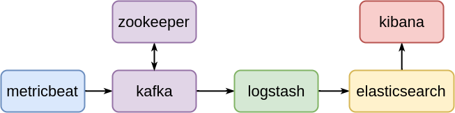
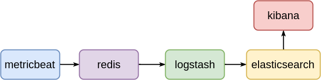

# ELK stack with Docker

The repository contains a set of ELK deployemnt scenarios implemented with
Docker.

## Requirements

1.  Install Docker engine (see [Install using the repository] on Docker pages)

        $ sudo apt-get remove docker docker-engine docker.io
        $ sudo apt-get update
        $ sudo apt-get install apt-transport-https ca-certificates curl software-properties-common
        $ curl -fsSL https://download.docker.com/linux/ubuntu/gpg | sudo apt-key add -
        $ sudo add-apt-repository "deb [arch=amd64] https://download.docker.com/linux/ubuntu $(lsb_release -cs) stable"
        $ sudo apt-get update
        $ sudo apt-get install docker-ce

2.  Install Docker compose (see [Install Compose] on Docker pages)

        $ sudo curl -L https://github.com/docker/compose/releases/download/1.17.1/docker-compose-Linux-x86_64 -o /usr/local/bin/docker-compose
        $ sudo chmod +x /usr/local/bin/docker-compose

[Install using the repository]: https://docs.docker.com/engine/installation/linux/docker-ce/ubuntu/#install-using-the-repository
[Install Compose]: https://docs.docker.com/compose/install/#install-compose

## Scenario 1

The current scenario implements the following architecture

Logs are generated by [Metricbeat] (shipper) and sent to a single-node [Kafka]
cluster (broker). [Logstash] (indexer) fetches the logs from the broker and
stores them on [Elasticsearch] (storage). [Kibana] (viewer) fetches and
displays the stored logs.

Run the following command to locally deploy the scenario

    docker-compose -f docker-compose.s1.yml up --build

## Scenario 2

The resulting architecture is below depicted

Logs are generated by [Metricbeat] (shipper) and sent to a [Redis] node
(broker). [Logstash] (indexer) fetches the logs from the broker and
stores them on [Elasticsearch] (storage). [Kibana] (viewer) fetches and
displays the stored logs.

Run the following command to locally deploy the scenario

    $ docker-compose -f docker-compose.s2.yml up --build

[Metricbeat]: https://www.elastic.co/products/beats/metricbeat
[Kafka]: https://kafka.apache.org
[Zookeeper]: https://zookeeper.apache.org
[Redis]: https://redis.io
[Logstash]: https://www.elastic.co/products/logstash
[Elasticsearch]: https://www.elastic.co/products/elasticsearch
[Kibana]: https://www.elastic.co/products/kibana
